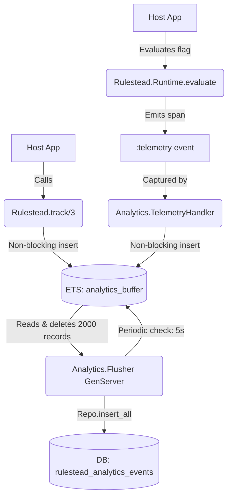

# Phase 17: Analytics & Metrics Ingestion - Research

**Researched:** 2026-05-17
**Domain:** Elixir/OTP Concurrency, Ecto Batch Insertion, Telemetry
**Confidence:** HIGH

## Summary

Phase 17 focuses on building a high-throughput, loss-tolerant analytics pipeline inside Rulestead. The goal is to accurately capture flag impressions (exposures) and custom host app metrics (conversions) without negatively impacting the performance or connection pool of the primary host database. The core recommendation is to use an ETS-backed GenServer batcher (`Rulestead.Analytics.Flusher`), where writes to ETS are entirely non-blocking and the Flusher periodically drains the buffer into Postgres via `Ecto.Repo.insert_all`.

**Primary recommendation:** Use a single `:public, :set, :write_concurrency` ETS table keyed by a unique monotonic integer, drained by a GenServer using `:ets.select` and `Repo.insert_all`.

<phase_requirements>
## Phase Requirements

| ID | Description | Research Support |
|----|-------------|------------------|
| ANA-01 | Ingest and store flag evaluation impressions... | GenServer batcher + ETS table, Telemetry handler for `[:rulestead, :eval, :decide, :stop]` |
| ANA-02 | Provide an API and integration seam for the host application... | `Rulestead.track/3` API boundary emitting to the ETS buffer |
</phase_requirements>

## Architectural Responsibility Map

| Capability | Primary Tier | Secondary Tier | Rationale |
|------------|-------------|----------------|-----------|
| Ingestion API (`track/3`) | API / Backend | — | Simple function boundary for host apps to record custom events. |
| Batching Buffer | Backend | — | In-memory `:ets` + GenServer for non-blocking high throughput metric buffering. |
| Data Persistence | Database | Backend | Appends records using `Repo.insert_all` to minimize connection pool contention. |
| Analytics Hook | Backend | — | Telemetry handler capturing `[:rulestead, :eval, :decide, :stop]` to populate exposure analytics. |

## Standard Stack

### Core
| Library | Version | Purpose | Why Standard |
|---------|---------|---------|--------------|
| `:ets` | (OTP 22+) | High-throughput in-memory buffer | Native OTP, provides `:write_concurrency` for zero-blocking concurrent writes. |
| `Elixir.GenServer` | (Elixir) | Periodic Flusher | Standard worker for periodic background tasks. |
| `Ecto.Repo` | ~> 3.13 | Batch database insertion | `insert_all` bypasses schema overhead for massive inserts. |
| `:telemetry` | ~> 1.0 | Impression capturing | Idiomatic way to hook into existing `Rulestead.Runtime.evaluate/3` without coupling concerns. |

### Alternatives Considered
| Instead of | Could Use | Tradeoff |
|------------|-----------|----------|
| GenServer/ETS | Oban | Oban jobs cost 1 DB write per enqueue. Queueing a job per impression exhausts the DB just as fast as writing the metric directly. |
| GenServer/ETS | Broadway | Massive dependency overkill for simple Postgres appending. Broadway is better suited for external queues (SQS/Kafka). |
| GenServer/ETS | Task.Supervisor | Fire-and-forget tasks block on Ecto connection checkout, causing cascading failures under high traffic load. |

## Architecture Patterns

### System Architecture Diagram



### Recommended Project Structure
```
lib/rulestead/analytics/
├── batcher.ex           # The ETS table creator and GenServer flusher
├── event.ex             # The Ecto Schema for `rulestead_analytics_events`
├── event_mapper.ex      # Pure functions mapping ETS records to Ecto insert maps
└── telemetry_handler.ex # Hooks into Rulestead core telemetry to feed the batcher
lib/rulestead/analytics.ex # Public API (track/3)
```

### Pattern 1: Non-blocking Concurrent ETS Appends
**What:** Using `System.unique_integer([:monotonic])` as a key in a `:set` or `:ordered_set` to allow multiple processes to append to the ETS table without locking or using a complex `Counter` strategy.
**When to use:** When you need a high-volume, unordered log of events in memory.
**Example:**
```elixir
# ETS Table setup
:ets.new(:rulestead_analytics_buffer, [
  :named_table,
  :public,
  :set,
  :write_concurrency
])

# Writer (track/3 or Telemetry Handler)
key = System.unique_integer([:monotonic])
:ets.insert(:rulestead_analytics_buffer, {key, event_map})
```

### Pattern 2: Atomic Select and Take
**What:** The flusher must pull X records from the table and delete *only* those records without losing newly arrived events.
**When to use:** In the periodic GenServer `handle_info(:flush, state)`.
**Example:**
```elixir
limit = 2000
match_spec = [{{:"$1", :"$2"}, [], [:"$1"]}]

case :ets.select(:rulestead_analytics_buffer, match_spec, limit) do
  :"$end_of_table" -> :ok
  {keys, _continuation} ->
    # Atomically read and delete the specific records we found
    records = Enum.flat_map(keys, &:ets.take(:rulestead_analytics_buffer, &1))
    
    # Extract values, map to DB format, and batch insert
    events = Enum.map(records, fn {_k, event} -> event end)
    Repo.insert_all(Analytics.Event, events)
end
```

### Anti-Patterns to Avoid
- **Table Rotation with `:persistent_term`:** While fast, updating `:persistent_term` triggers a global GC pass across the entire BEAM. Doing this every 5 seconds is a massive performance footgun. Stick to a single `:public` table with `select` and `take`.
- **Using `insert_all` with `autogenerate: true`:** Ecto schema autogenerate fields (like IDs) and `timestamps()` are ignored by `insert_all`. They must be manually generated and populated in the struct maps before calling `insert_all`.

## Don't Hand-Roll

| Problem | Don't Build | Use Instead | Why |
|---------|-------------|-------------|-----|
| UUIDv7 Generation | Custom time-shifted binary bit-shifting | `Ecto.UUID.generate()` / `Ecto.UUID.bingenerate()` | Ecto natively supports robust, fast UUID generation. Even if native v7 is missing in older Ecto, standard UUIDv4 via Ecto is preferred over buggy hand-rolled v7 unless temporal locality strictly demands an external library. |
| Time-series chunking | Complex rolling window queries in SQL | Rely on Host App BI / Export | Rulestead's job is ingestion. Exposing `id` and `occurred_at` allows hosts to export to Snowflake/ClickHouse for complex time-series queries. |

## Common Pitfalls

### Pitfall 1: Failing to explicitly generate Ecto fields during `insert_all`
**What goes wrong:** `Repo.insert_all` throws SQL errors about missing `id`, `inserted_at`, or `updated_at`.
**Why it happens:** Ecto deliberately skips the schema struct lifecycle (`autogenerate`, `timestamps()`) during `insert_all` for performance.
**How to avoid:** The Flusher's mapping logic must inject these fields.
```elixir
now = DateTime.utc_now() |> DateTime.truncate(:usec)
id = Ecto.UUID.generate()
Map.merge(event, %{id: id, occurred_at: now, inserted_at: now, updated_at: now})
```

### Pitfall 2: OOMing the BEAM Node during DB Outages
**What goes wrong:** If Postgres goes down, the Flusher's `Repo.insert_all` fails. The ETS table continues to fill with thousands of requests per second, eventually exhausting all system memory.
**Why it happens:** No upper bound limit on the ETS buffer.
**How to avoid:** Before the writer calls `:ets.insert`, check `ets.info(table, :size)`. If it exceeds a max (e.g., 50,000), drop the event and emit `[:rulestead, :analytics, :dropped]`.

## Code Examples

### Attaching the Telemetry Handler
```elixir
# lib/rulestead/analytics/telemetry_handler.ex
def attach do
  :telemetry.attach(
    "rulestead-analytics-eval",
    [:rulestead, :eval, :decide, :stop],
    &__MODULE__.handle_event/4,
    %{}
  )
end

def handle_event(_event, _measurements, metadata, _config) do
  # Convert the evaluation stop metadata into an "exposure" event
  # and insert into the ETS buffer.
  event = %{
    kind: "exposure",
    actor_id: Map.get(metadata, :targeting_key),
    event_name: metadata.flag_key,
    env: metadata.environment,
    metadata: %{
      variant: metadata.variant,
      experiment_bucket: metadata.experiment_bucket
    }
  }
  
  Rulestead.Analytics.Batcher.insert(event)
end
```

## State of the Art

| Old Approach | Current Approach | When Changed | Impact |
|--------------|------------------|--------------|--------|
| Synchronous inserts | Asynchronous Batching via ETS | Phase 17 | DB Connection Pools are protected from metric spikes. |
| Active Record Callbacks | Telemetry Event Spans | Phase 4+ | Decouples analytics logging from the core evaluation engine logic. |

## Open Questions (RESOLVED)

1. **UUIDv7 Native Support**
   - What we know: The architecture specifies UUIDv7 for temporal clustering. Ecto `3.13` defaults to UUIDv4 in `Ecto.UUID.generate()`.
   - What's unclear: Should we include an external library (e.g., `uniq`) just to generate UUIDv7, or is UUIDv4 sufficient for the `id` field since we explicitly store `occurred_at` anyway?
   - Resolution: Use `Ecto.UUID.generate()` (v4) for simplicity. We explicitly store and index `occurred_at`, so temporal clustering and batch joins do not strictly require a time-sortable primary key. We will avoid adding external dependencies.

## Environment Availability

| Dependency | Required By | Available | Version | Fallback |
|------------|------------|-----------|---------|----------|
| PostgreSQL | Data layer | ✓ | N/A | — |
| Elixir / OTP | Batcher | ✓ | 1.15+ | — |

## Validation Architecture

### Test Framework
| Property | Value |
|----------|-------|
| Framework | ExUnit |
| Config file | `test/test_helper.exs` |
| Quick run command | `mix test path/to/file_test.exs` |
| Full suite command | `mix test` |

### Phase Requirements → Test Map
| Req ID | Behavior | Test Type | Automated Command | File Exists? |
|--------|----------|-----------|-------------------|-------------|
| ANA-01 | Flusher drains ETS and bulk inserts to DB | unit/integration | `mix test test/rulestead/analytics/batcher_test.exs` | ❌ Wave 0 |
| ANA-01 | Telemetry handler intercepts eval and pushes to ETS | unit | `mix test test/rulestead/analytics/telemetry_handler_test.exs` | ❌ Wave 0 |
| ANA-02 | `track/3` API pushes valid map to ETS buffer | unit | `mix test test/rulestead/analytics_test.exs` | ❌ Wave 0 |

### Sampling Rate
- **Per task commit:** `mix test test/rulestead/analytics/`
- **Per wave merge:** `mix test`
- **Phase gate:** Full suite green before `/gsd-verify-work`

### Wave 0 Gaps
- [ ] `test/rulestead/analytics/batcher_test.exs` — covers ANA-01 ingestion loop.
- [ ] `test/rulestead/analytics_test.exs` — covers ANA-02 API boundary.
- [ ] `test/rulestead/analytics/telemetry_handler_test.exs` — covers ANA-01 hook.

## Security Domain

### Applicable ASVS Categories

| ASVS Category | Applies | Standard Control |
|---------------|---------|-----------------|
| V5 Input Validation | yes | Ecto Changesets (for schema validation) before batching / sanitizing `actor_id` sizes |

### Known Threat Patterns for Elixir/Ecto

| Pattern | STRIDE | Standard Mitigation |
|---------|--------|---------------------|
| Resource Exhaustion (Memory) | Denial of Service | Hard cap `ets.info(:size)` check before inserting new analytics events |
| Database Connection Pool Exhaustion | Denial of Service | Buffer events in ETS and flush via GenServer instead of direct inserts |
| PII Leakage | Information Disclosure | Do not log full context objects; only extract specific required fields like `targeting_key` |

## Sources

### Primary (HIGH confidence)
- `/Users/jon/projects/rulestead/.planning/research/PHASE_17_ARCHITECTURE.md` - Confirmed Architectural Recommendation for GenServer Batcher
- `/Users/jon/projects/rulestead/.planning/milestones/v0.4.0-ROADMAP.md` - Confirmed ANA-01/02 Phase Requirements
- Ecto / Elixir standard library knowledge

### Secondary (MEDIUM confidence)
- Context7 Ecto Documentation

## Metadata

**Confidence breakdown:**
- Standard stack: HIGH - Core OTP patterns (ETS, GenServer)
- Architecture: HIGH - Dictated firmly by `PHASE_17_ARCHITECTURE.md`
- Pitfalls: HIGH - Common constraints of `insert_all` in Ecto are well understood.

**Research date:** 2026-05-17
**Valid until:** 2026-06-17
