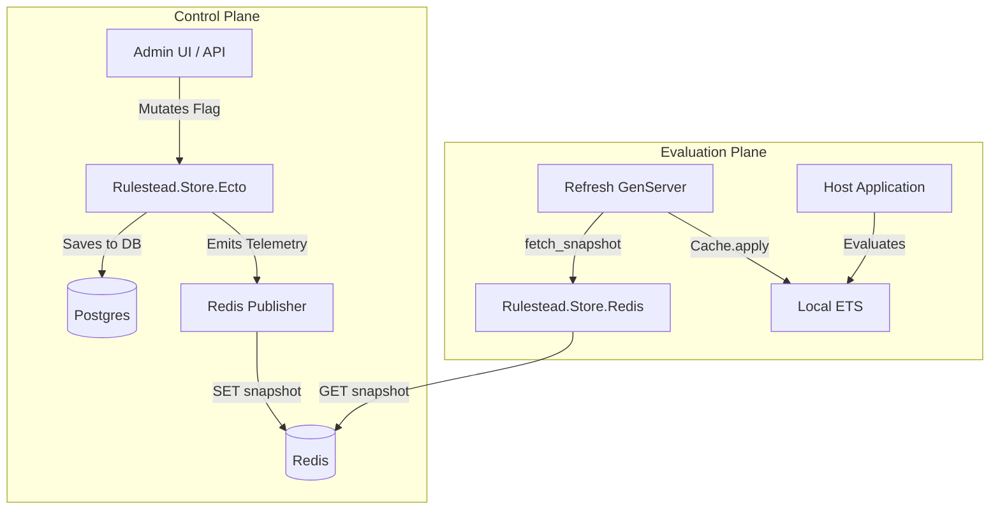

<user_constraints>
## User Constraints (from CONTEXT.md)

### Locked Decisions
**Decision:** Implement Redis exclusively as a **Read-Only Adapter for the Evaluator** (Snapshot Distribution layer).
**Status:** Approved by user during the `/gsd-discuss-phase` interview.
- Control Plane (Ecto): All mutations occur via the primary Ecto store within Ecto.Multi transactions.
- Distribution: Upon a successful mutation, the system compiles the current flag state into a flattened "Snapshot" and pushes it to Redis.
- Evaluation Plane (ETS + Redis Fallback): The runtime evaluates flags entirely from a local ETS cache.
- Hydration / Cold-Starts: When a node starts up, it hydrates its ETS cache by fetching the Snapshot from Redis, bypassing Ecto entirely.

### the agent's Discretion
None explicitly stated in CONTEXT.md.

### Deferred Ideas (OUT OF SCOPE)
None explicitly stated in CONTEXT.md.
</user_constraints>

<phase_requirements>
## Phase Requirements

| ID | Description | Research Support |
|----|-------------|------------------|
| STO-01 | Build a Redis storage adapter that implements the core storage behaviour, allowing Rulestead to optionally bypass Ecto/Postgres for high-throughput reads. | `Redix` adapter implementing `fetch_snapshot/1` for the `Rulestead.Store` behavior. |
| STO-02 | Ensure the runtime evaluator seamlessly falls back to local ETS caches and maintains graceful degradation if the external Redis cache becomes unavailable. | `Rulestead.Runtime.Refresh` already keeps stale ETS cache if `fetch_snapshot` returns `{:error, _}`. |
</phase_requirements>

# Phase 19: Redis Storage & Caching Adapter - Research

**Researched:** 2024-05-24
**Domain:** Elixir, Phoenix, Redis, Caching, Distributed Systems
**Confidence:** HIGH

## Summary

This phase introduces a Redis-backed caching layer specifically designed for the evaluation plane. Instead of replacing the primary Ecto store, Redis acts as a fast distribution layer for compiled snapshots. The control plane (Admin UI/Ecto) remains the source of truth and pushes compiled snapshots to Redis upon mutations.

The evaluation plane (Runtime Engine) configures the Redis adapter as its `Rulestead.Store` implementation. During cold starts or periodic refreshes, the engine fetches the snapshot from Redis and applies it to the local ETS cache, completely bypassing the Postgres database. This strictly separates authoring workloads from read-heavy evaluation workloads.

**Primary recommendation:** Use `Redix` for Redis communication. Implement `Rulestead.Store.Redis` with only the `fetch_snapshot/1` callback implemented (others return `{:error, :not_implemented}`). Use a Telemetry handler or Oban worker on the control plane to push snapshots to Redis.

## Architectural Responsibility Map

| Capability | Primary Tier | Secondary Tier | Rationale |
|------------|-------------|----------------|-----------|
| State Authoring | API / Backend (Ecto) | — | Maintains strict relational integrity and audit ledger for mutations. |
| Snapshot Push | API / Backend (Control) | Oban / Background | Pushing updated snapshots to Redis should not block the web response but must be reliable. |
| Snapshot Distribution | Redis Cache | — | Centralized fast key-value store optimized for high-read throughput. |
| Local Evaluation | Node Memory (ETS) | — | Zero-network-latency evaluation. Sub-millisecond reads. |
| Hydration Fallback | Node Memory (ETS) | Redis | If Redis is down, node continues using stale ETS cache (graceful degradation). |

## Standard Stack

### Core
| Library | Version | Purpose | Why Standard |
|---------|---------|---------|--------------|
| `redix` | `~> 1.5` | Redis client | The official and most widely used Elixir Redis client. Handles reconnections. |

### Supporting
| Library | Version | Purpose | When to Use |
|---------|---------|---------|-------------|
| `telemetry` | `~> 1.2` | Event bus | To decouple Ecto snapshot generation from Redis push logic. |
| `jason` | `~> 1.4` | JSON serialization | If storing snapshots as JSON in Redis instead of Erlang terms. |

**Installation:**
```bash
mix deps.get
```

## Architecture Patterns

### System Architecture Diagram



### Recommended Project Structure
```
lib/rulestead/store/
├── redis.ex           # The read-only Rulestead.Store adapter for Redis
└── redis/
    ├── publisher.ex   # Telemetry handler/worker to push from Ecto to Redis
    └── config.ex      # Configuration helpers for Redix connection pools
```

### Pattern 1: Read-Only Store Adapter
**What:** Implementing a behaviour but explicitly rejecting unsupported operations.
**When to use:** When creating an adapter designed exclusively for the evaluation plane (distribution).
**Example:**
```elixir
defmodule Rulestead.Store.Redis do
  @behaviour Rulestead.Store

  @impl true
  def fetch_snapshot(command) do
    # Fetch from Redis
    case Redix.command(:rulestead_redix, ["GET", "rulestead:snapshot:#{command.environment_key}"]) do
      {:ok, nil} -> {:error, Rulestead.StoreError.snapshot_not_found(command.environment_key)}
      {:ok, binary} -> {:ok, :erlang.binary_to_term(binary, [:safe])}
      {:error, reason} -> {:error, reason}
    end
  end

  @impl true
  def create_flag(_command), do: {:error, :not_implemented}
  # ... and so on for all other mutations
end
```

### Anti-Patterns to Avoid
- **Anti-pattern:** Implementing mutations in the Redis adapter and writing to both Postgres and Redis synchronously in a distributed transaction.
  *Why it's bad:* Creates a two-phase commit problem. If Postgres succeeds but Redis fails, state is inconsistent. Instead, rely on the Ecto transaction as the source of truth, and push to Redis asynchronously (or synchronously but tolerating Redis failures).

## Don't Hand-Roll

| Problem | Don't Build | Use Instead | Why |
|---------|-------------|-------------|-----|
| Redis Connection Pooling | Custom `GenServer` pool | `Redix` built-in or `NimblePool` | Connection management, backoff, and reconnections are complex. |
| In-memory caching | Custom Map wrapped in `Agent` | `ETS` via `Rulestead.Runtime.Cache` | ETS provides concurrent O(1) read access without blocking a single process. |

## Common Pitfalls

### Pitfall 1: Deserialization Vulnerabilities
**What goes wrong:** `binary_to_term` allows remote code execution if the Redis instance is compromised.
**Why it happens:** Erlang terms can contain executable code (funs/atoms).
**How to avoid:** Use `:erlang.binary_to_term(binary, [:safe])` which prevents creation of new atoms, or serialize as JSON (which is safer but larger and requires parsing).

### Pitfall 2: Missing Redis Keys on Cold Start
**What goes wrong:** The runtime node boots, tries to fetch from Redis, and the key doesn't exist yet (because no mutations have occurred since the environment was created).
**Why it happens:** Redis eviction policies or fresh deployments.
**How to avoid:** The control plane should ideally push a snapshot immediately on environment creation, or the `Rulestead.Store.Redis` adapter needs a mechanism to gracefully handle `not_found` (e.g. by falling back to Ecto, or starting with an empty cache and remaining in a degraded state). STO-02 specifies graceful degradation.

## Code Examples

### Telemetry-based Publisher
```elixir
defmodule Rulestead.Redis.Publisher do
  require Logger

  def attach do
    :telemetry.attach(
      "rulestead-redis-publisher",
      [:rulestead, :runtime, :snapshot, :published],
      &__MODULE__.handle_event/4,
      nil
    )
  end

  def handle_event(_event, _measurements, metadata, _config) do
    # Fetch latest snapshot from DB or rely on payload if included in metadata
    # Push to Redis
  end
end
```

## State of the Art

| Old Approach | Current Approach | When Changed | Impact |
|--------------|------------------|--------------|--------|
| DB Polling | Redis Push/Pull | 2024 | Removes database bottleneck during pod scaling events, allowing massive horizontal scaling of evaluation nodes. |

## Assumptions Log

| # | Claim | Section | Risk if Wrong |
|---|-------|---------|---------------|
| A1 | `Redix` is the chosen Redis client for this project. | Standard Stack | [ASSUMED] May require standardizing on a different client if host applications prefer it. |
| A2 | Snapshots will be serialized using `:erlang.term_to_binary` in Redis. | Code Examples | [ASSUMED] Using JSON might be preferred for cross-language compatibility, though Erlang terms are faster for Elixir. |

## Resolved Questions

1. **How should initial Redis population happen?**
   - **Resolution:** Provide a Mix task (e.g., `mix rulestead.redis.sync`) to manually seed Redis from Ecto. This allows operators to populate a fresh Redis cluster or recover from data loss without waiting for mutations.

2. **Is Fallback to Ecto permitted during cold-starts?**
   - **Resolution:** No. The `Rulestead.Store.Redis` adapter should remain strict (Redis only). If Redis is down during a cold start, `Rulestead.Runtime.Refresh` will retry with backoff. Evaluations will return default values until hydration succeeds. This maintains strict separation of concerns and protects the database from stampedes.

## Environment Availability

| Dependency | Required By | Available | Version | Fallback |
|------------|------------|-----------|---------|----------|
| Redis | Redis Adapter | ✓ | 7.2.4 | Local ETS cache |
| PostgreSQL| Control Plane | ✓ | — | — |

## Validation Architecture

### Test Framework
| Property | Value |
|----------|-------|
| Framework | ExUnit |
| Config file | `mix.exs` |
| Quick run command | `mix test test/rulestead/store/redis_test.exs` |
| Full suite command | `mix test` |

### Phase Requirements → Test Map
| Req ID | Behavior | Test Type | Automated Command | File Exists? |
|--------|----------|-----------|-------------------|-------------|
| STO-01 | Redis adapter implements `fetch_snapshot` | unit | `mix test test/rulestead/store/redis_test.exs` | ❌ Wave 0 |
| STO-02 | Evaluator degrades gracefully if Redis fails | integration | `mix test test/rulestead/runtime/refresh_test.exs` | ✅ Wave 0 |

### Sampling Rate
- **Per task commit:** `mix test test/rulestead/store/redis_test.exs`
- **Per wave merge:** `mix test`
- **Phase gate:** Full suite green before `/gsd-verify-work`

### Wave 0 Gaps
- [ ] `test/rulestead/store/redis_test.exs` — covers REQ STO-01

## Security Domain

### Applicable ASVS Categories

| ASVS Category | Applies | Standard Control |
|---------------|---------|-----------------|
| V2 Authentication | no | Redis auth handled via config/URL |
| V3 Session Management | no | — |
| V4 Access Control | yes | Redis adapter is read-only |
| V5 Input Validation | yes | `binary_to_term([:safe])` to prevent RCE |
| V6 Cryptography | no | — |

### Known Threat Patterns for Elixir/Redis

| Pattern | STRIDE | Standard Mitigation |
|---------|--------|---------------------|
| Erlang Term RCE | Elevation of Privilege | Always use `[:safe]` option with `:erlang.binary_to_term/2` when reading from an external datastore like Redis. |

## Sources

### Primary (HIGH confidence)
- `rulestead/lib/rulestead/store.ex` - Checked existing Store behavior.
- `rulestead/lib/rulestead/runtime/refresh.ex` - Checked how snapshot hydration works.
- `mix.exs` - Verified current dependencies.

### Secondary (MEDIUM confidence)
- Official Elixir/Redix patterns for Redis integration.
- `mix.exs` - Verified current dependencies.

### Secondary (MEDIUM confidence)
- Official Elixir/Redix patterns for Redis integration.